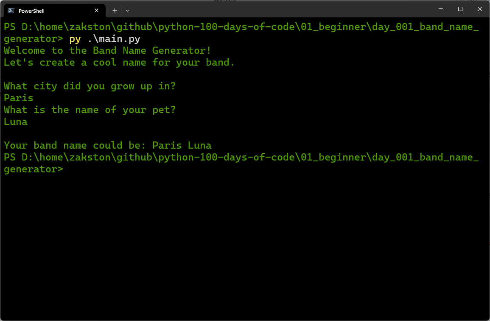

# Band Name Generator
A simple program that asks for the user's city and pet name, then combines them into a band name.

## What I Practiced
- Using `print()` to show messages.
- Using `input()` to get user data.
- Storing values in variables.
- Concatenating strings with `+`.

## How to Run
1. Make sure Python 3 is installed.
2. Open terminal in the `day_01_band_name_generator` folder.
3. Run:
    ```bash
    py main.py
    ```
4. Follow the prompts.

## Example
```text
Welcome to the Band Name Generator!
Let's create a cool name for your band.

What city did you grow up in?
Paris
What is the name of your pet?
Luna

Your band name could be: Paris Luna
```

## Screenshot

