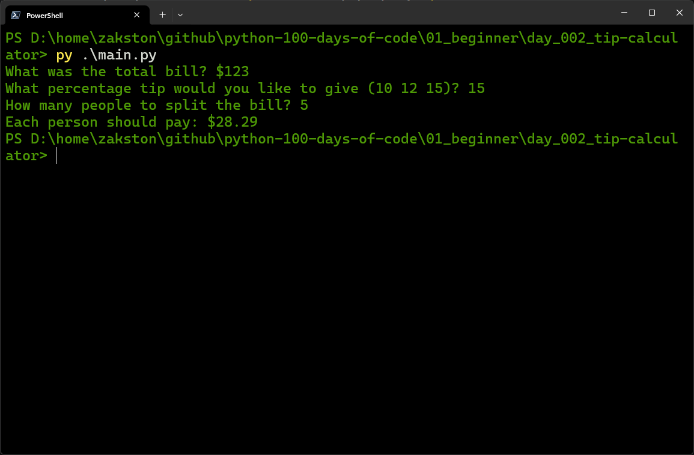

# Tip Calculator
A simple program that calculates the amount each person should pay when splitting a restaurant bill, including a tip.

## What I Practiced
- Working with `float` and `int` data types.
- Converting user input with `input()` and type casting.
- Performing arithmetic operations.
- Using f-strings to format output with two decimal places.

## How to Run
1. Make sure Python 3 is installed.
2. Open terminal in the `day_002_tip_calculator` folder.
3. Run:
    ```bash
    py main.py
    ```
4. Follow the prompts.

## Screenshot

