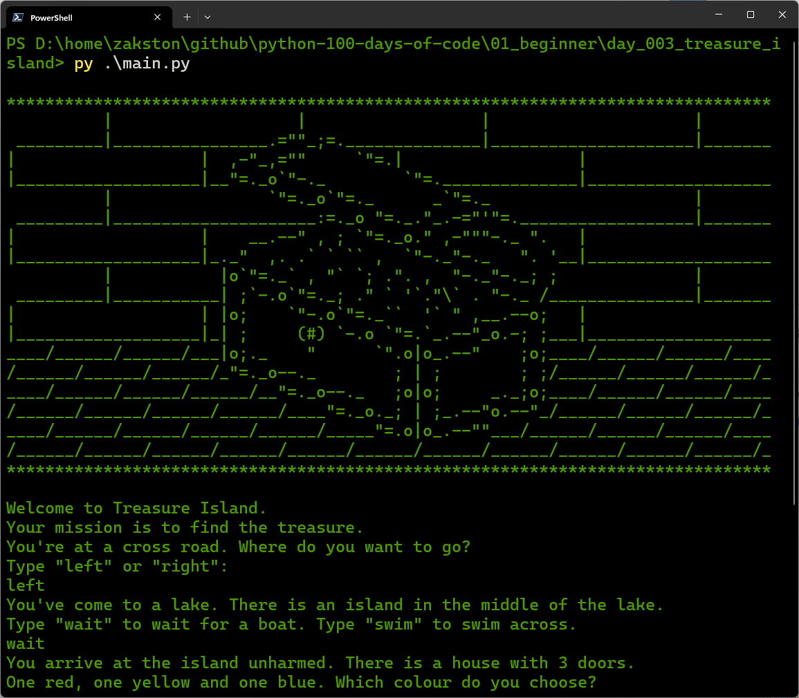

# Treasure Island
A text-based adventure game where you make choices to find the treasure. The game uses nested conditional statements to determine the outcome based on your decisions.

## What I Practiced
- Using `if`, `elif`, and `else` statements.
- Nesting conditional statements.
- Converting user input to lowercase for case‑insensitive comparisons.
- Working with escape characters (`\"`) to print quotes.

## How to Run
1. Make sure Python 3 is installed.
2. Open terminal in the `day_03_treasure_island` folder.
3. Run:
    ```bash
    py main.py
    ```
4. Follow the prompts.

## Screenshot

