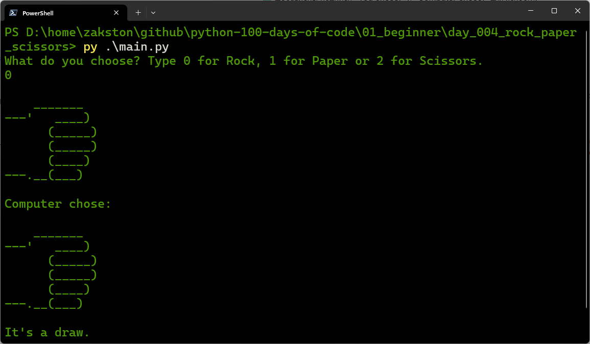

# Rock Paper Scissors
A classic Rock Paper Scissors game against the computer. The player chooses rock, paper, or scissors, and the computer randomly selects its choice. The winner is determined by the classic rules.

## What I Practiced
- Working with lists to store multiple values.
- Using the `random` module to generate random numbers.
- Handling user input with `input()` and type conversion.
- Using `if`, `elif`, and `else` for conditional logic.
- Comparing values to determine the game outcome.

## How to Run
1. Make sure Python 3 is installed.
2. Open terminal in the `day_004_rock_paper_scissors` folder.
3. Run:
    ```bash
    py main.py
    ```
4. Follow the prompts.

## Screenshot

