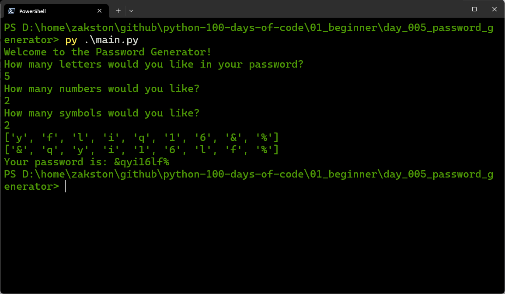

# Password Generator
A Python program that generates a random password based on user-specified criteria: number of letters, numbers, and symbols. The characters are randomly selected and then shuffled to create a strong password.

## What I Practiced
- Using `for` loops to repeat actions.
- Working with lists and the `append()` method.
- Using the `random` module to select random elements.
- Manually shuffling a list using a swap algorithm.
- Building a string from a list of characters.

## How to Run
1. Make sure Python 3 is installed.
2. Open terminal in the `day_05_password_generator` folder.
3. Run:
    ```bash
    py main.py
    ```
4. Follow the prompts.

## Screenshot

