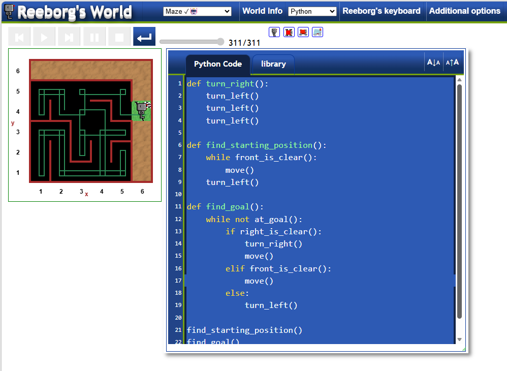

# Escaping the Maze (Reeborg's World)
A Python program that navigates a robot through a maze using the right-hand rule algorithm. The robot finds its way to the goal by following the right wall.

## What I Practiced
- Defining and using custom functions (`turn_right`, `find_starting_position`, `find_goal`).
- Using `while` loops for continuous movement until a condition is met (`at_goal()`).
- Implementing conditional logic (`if`, `elif`, `else`) with environment checks (`right_is_clear`, `front_is_clear`).
- Applying the right-hand rule algorithm to solve a maze.

## How to Run
1. Go to [Reeborg's World Maze](https://reeborg.ca/reeborg.html?lang=en&mode=python&menu=worlds%2Fmenus%2Freeborg_intro_en.json&name=Maze&url=worlds%2Ftutorial_en%2Fmaze1.json).
2. Copy and paste the code into the editor.
3. Click the "Run" button to watch Reeborg solve the maze.

## Screenshot

