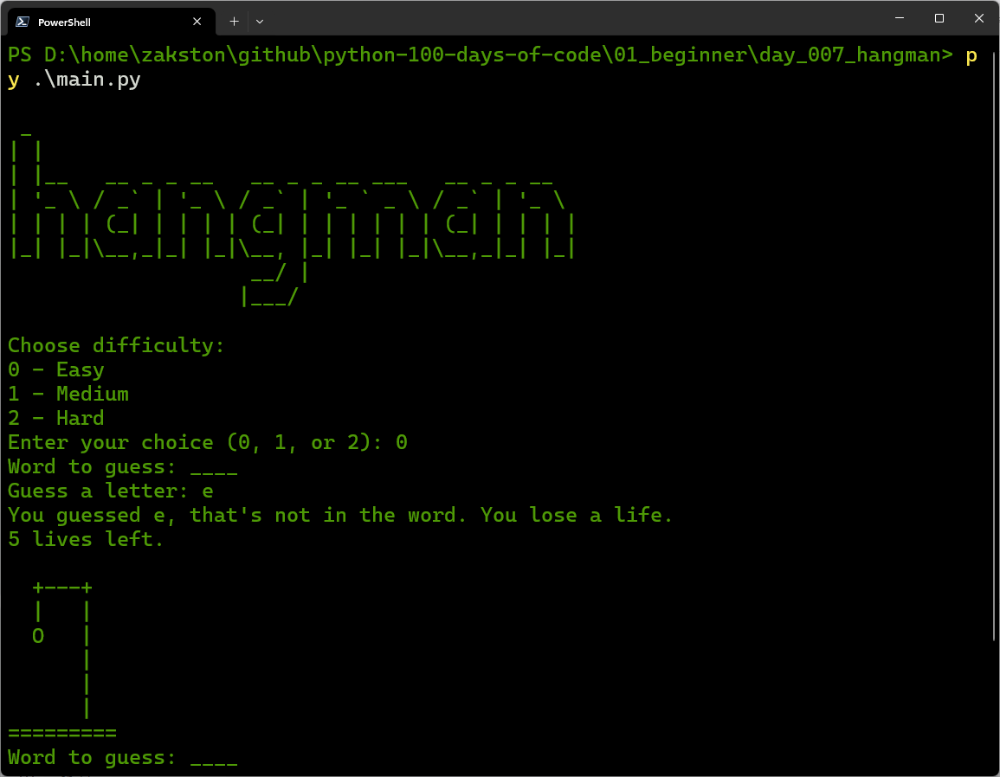

# Hangman
A classic Hangman game where the player guesses letters to reveal a hidden word. The game includes three difficulty levels (Easy, Medium, Hard) and displays a visual hangman as the player makes mistakes.

## What I Practiced
- Working with lists, strings, and loops.
- Using `random` to select a word.
- Validating user input with `isdigit()` and `isalpha()`.
- Managing game state with variables (`lives`, `guessed`, `placeholder`).
- Modularising code by importing data from separate files.

## How to Run
1. Make sure Python 3 is installed.
2. Open terminal in the `day_007_hangman` folder.
3. Run:
    ```bash
    py main.py
    ```
4. Follow the prompts.

## Screenshot

