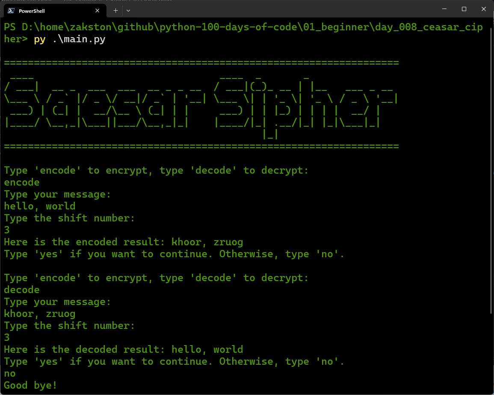

# Caesar Cipher
A Python program that encrypts and decrypts messages using the Caesar cipher technique. The user can choose to encode or decode a message by specifying a shift number.

## What I Practiced
- Using functions with positional and keyword arguments.
- String manipulation and indexing.
- Using `%` (modulo) for circular indexing.

## How to Run
1. Make sure Python 3 is installed.
2. Open terminal in the `day_008_caesar_cipher` folder.
3. Run:
    ```bash
    py main.py
    ```
4. Follow the prompts.

## Screenshot

