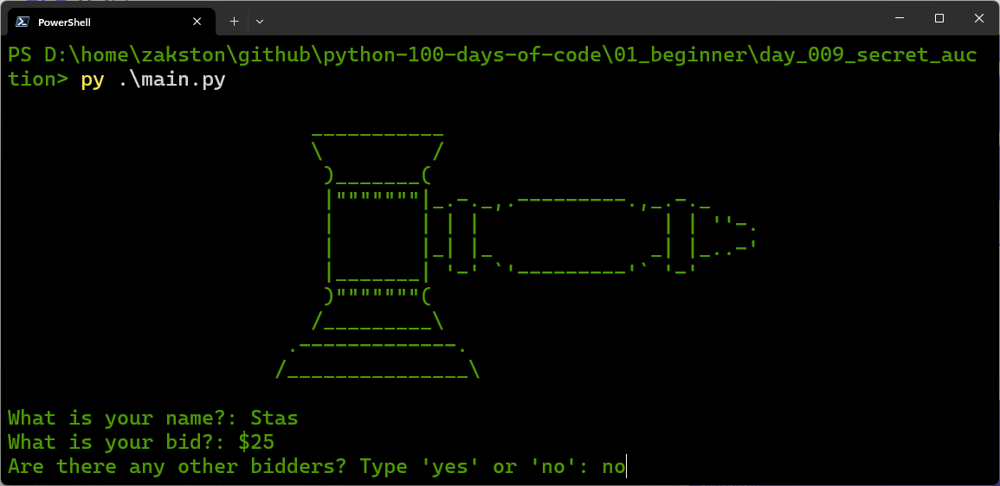

# Secret Auction
A small program that simulates a secret auction. Multiple bidders can enter their name and bid, and the program determines the highest bidder.

## What I Practiced
- Working with dictionaries (`dict`) to store key-value pairs (name: bid).
- Using `while` loops for repeated user input.
- Iterating over dictionaries with `for` loops.
- Finding the maximum value in a dictionary.
- Clearing the console screen for a better user experience.

## How to Run
1. Make sure Python 3 is installed.
2. Open terminal in the `day_009_secret_auction` folder.
3. Run:
    ```bash
    py main.py
    ```
4. Follow the prompts.

## Screenshot

