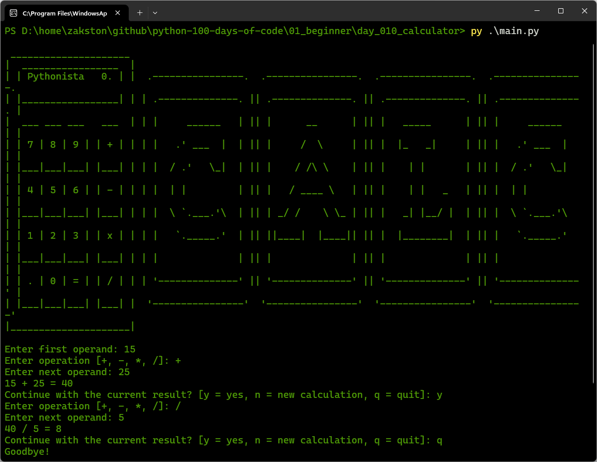

# Calculator
A simple yet powerful calculator that supports chaining operations. Users can perform addition, subtraction, multiplication, and division, and continue with the current result or start a new calculation.

## What I Practiced
- Defining and using functions with clear responsibilities.
- Input validation with `try/except` and loops.
- Handling continuous calculations with nested loops.
- Using constants (`VALID_OPERATIONS`) for better maintainability.
- Importing and organising code across multiple modules.
- Adding user-friendly prompts and error messages.

## How to Run
1. Make sure Python 3 is installed.
2. Open terminal in the `day_010_calculator` folder.
3. Run:
    ```bash
    py main.py
    ```
4. Follow the prompts.

## Screenshot

