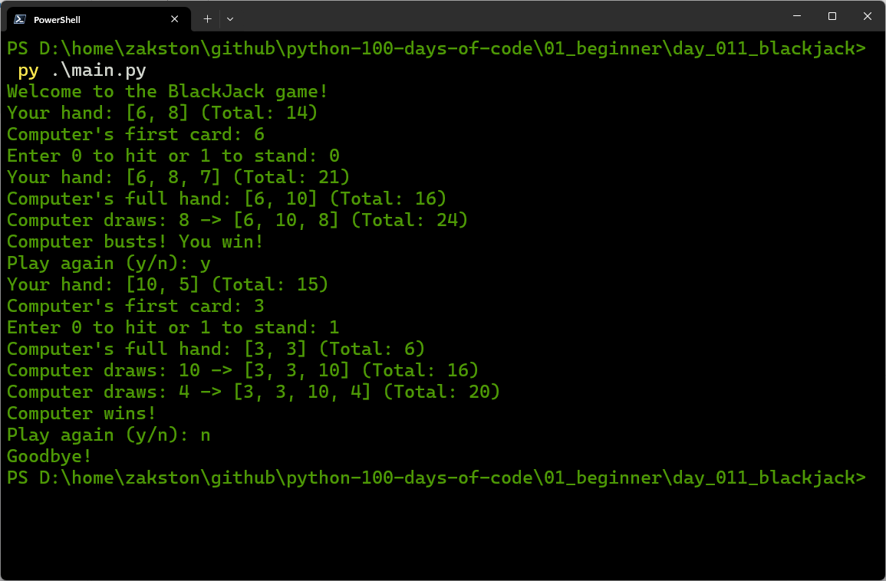

# Blackjack (21)
A simplified version of the classic card game Blackjack. The player competes against the computer (dealer). The goal is to get as close to 21 as possible without going over.

## What I Practiced
- Using functions to organise code and avoid repetition.
- Handling dynamic values (Aces) with conditional logic.
- Validating user input to prevent crashes.
- Implementing game flow with nested loops.
- Working with lists and the `random` module.

## How to Run
1. Make sure Python 3 is installed.
2. Open terminal in the `day_011_blackjack` folder.
3. Run:
    ```bash
    py main.py
    ```
4. Follow the prompts.

## Screenshot

