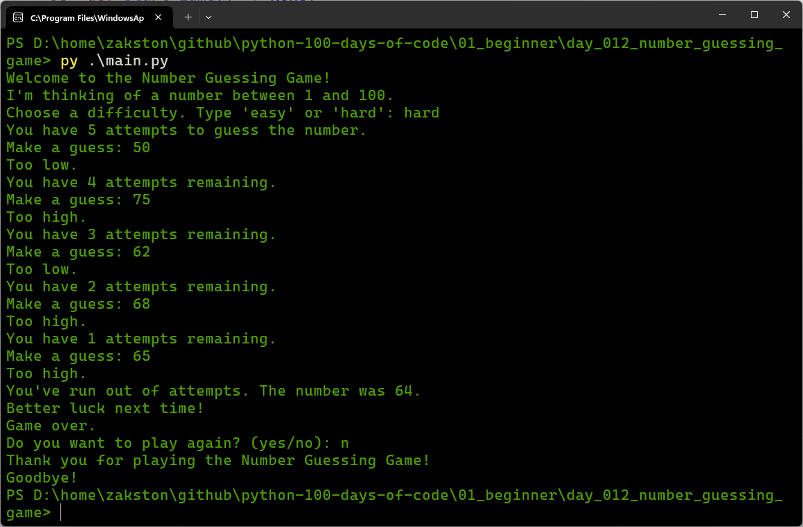

# Number Guessing Game
A simple game where the computer picks a random number between 1 and 100, and the player tries to guess it. The player can choose between easy mode (10 attempts) and hard mode (5 attempts).

## What I Practiced
- Using constants and dictionaries for configuration.
- Writing small, focused functions with clear responsibilities.
- Validating user input with `try/except` and loops.
- Implementing game logic with `while` loops and conditionals.
- Organising code for readability and maintainability.

## How to Run
1. Make sure Python 3 is installed.
2. Open terminal in the `day_012_number_guessing_game` folder.
3. Run:
    ```bash
    py main.py
    ```
4. Follow the prompts.

## Screenshot
