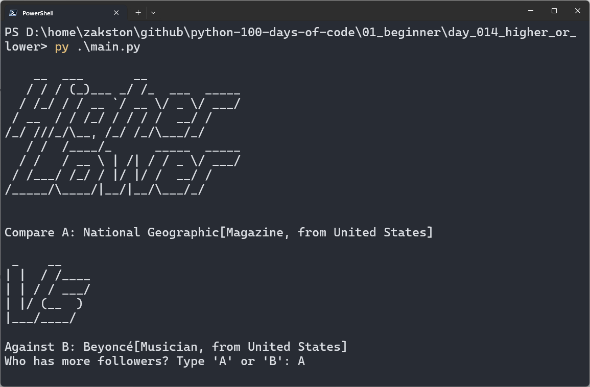

# Higher or Lower
A game where you guess which of two celebrities has more followers. The player scores a point for each correct guess, and the game continues until a wrong answer is given.

## What I Practiced
- Splitting code into small, focused functions.
- Simplifying complex conditions with a single `correct_answer` variable.
- Validating user input with a `while` loop.
- Clearing the console screen with ANSI escape codes.

## How to Run
1. Make sure Python 3 is installed.
2. Open terminal in the `day_014_higher_or_lower` folder.
3. Run:
    ```bash
    py main.py
    ```
4. Follow the prompts.

## Screenshot
