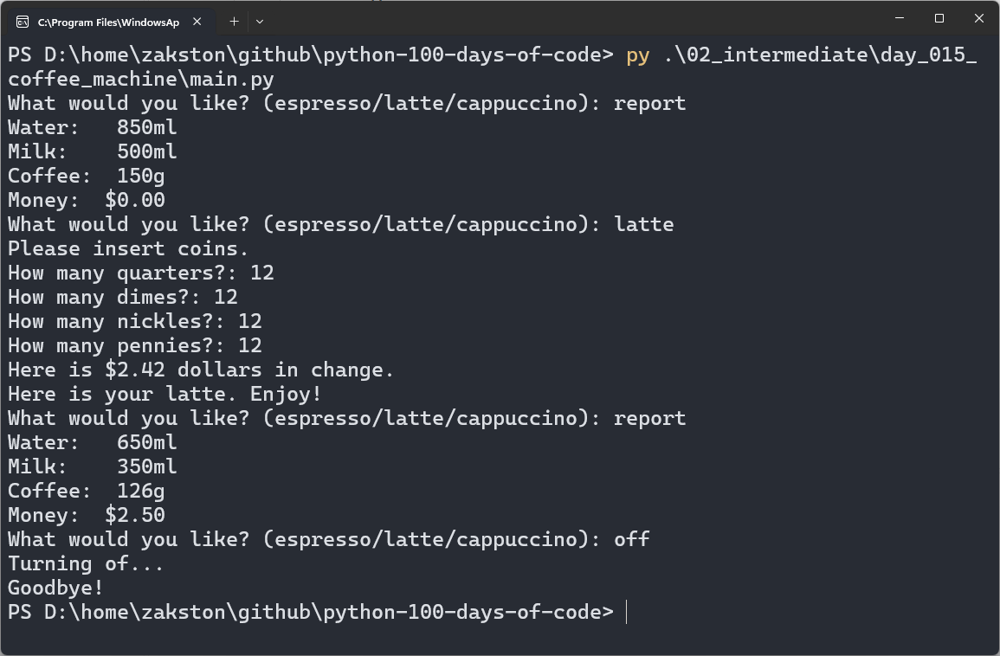

# Coffee Machine
A simulation of a coffee machine that serves espresso, latte, and cappuccino. The program checks resources, processes coins, and dispenses the chosen drink.

## What I Practiced
- Using nested dictionaries to model a menu and resources.
- Splitting logic into small, focused functions.
- Validating user input with `try/except`.
- Simulating a real-world workflow: check resources → payment → dispense.
- Using constants for menu items and commands (`report`, `off`).

## How to Run
1. Make sure Python 3 is installed.
2. Open terminal in the `day_015_coffee_machine` folder.
3. Run:
    ```bash
    py main.py
    ```
4. Follow the prompts.

## Screenshot

