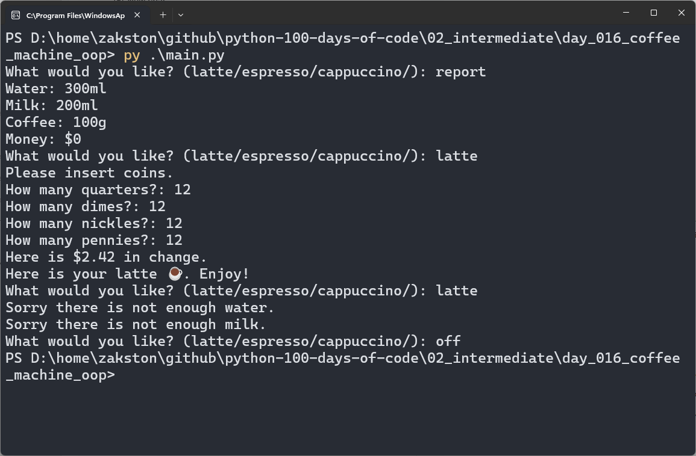

# Coffee Machine (OOP)
A refactored version of the Coffee Machine project, now built with Object-Oriented Programming. Uses separate classes for the menu, coffee maker, and money machine.

## What I Practiced
- Working with classes and objects.
- Importing and using custom modules (`Menu`, `CoffeeMaker`, `MoneyMachine`).
- Calling methods on objects (`menu.find_drink()`, `maker.is_resource_sufficient()`, etc.).
- Structuring the main loop cleanly with OOP.

## How to Run
1. Make sure Python 3 is installed.
2. Open terminal in the `day_016_coffee_machine_oop` folder.
3. Run:
    ```bash
    py main.py
    ```
4. Follow the prompts.

## Screenshot

