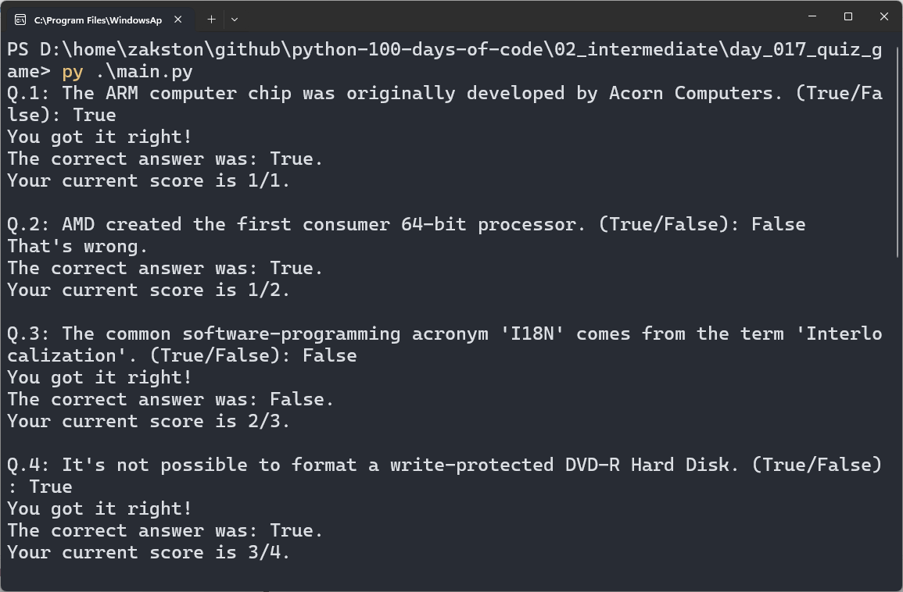

# Quiz Game (OOP)
A true/false quiz game built with Object-Oriented Programming. Questions are loaded from a data file, converted into `Question` objects, and managed by a `QuizBrain` class.

## What I Practiced
- Creating classes with `__init__` and instance attributes.
- Separating data (`Question`) from logic (`QuizBrain`).
- Building a list of objects from a list of dictionaries.
- Using a `while` loop driven by a method (`still_has_questions`).
- Tracking state (score, question index) inside an object.

## How to Run
1. Make sure Python 3 is installed.
2. Open terminal in the `day_017_quize_game` folder.
3. Run:
    ```bash
    py main.py
    ```
4. Follow the prompts.

## Screenshot

