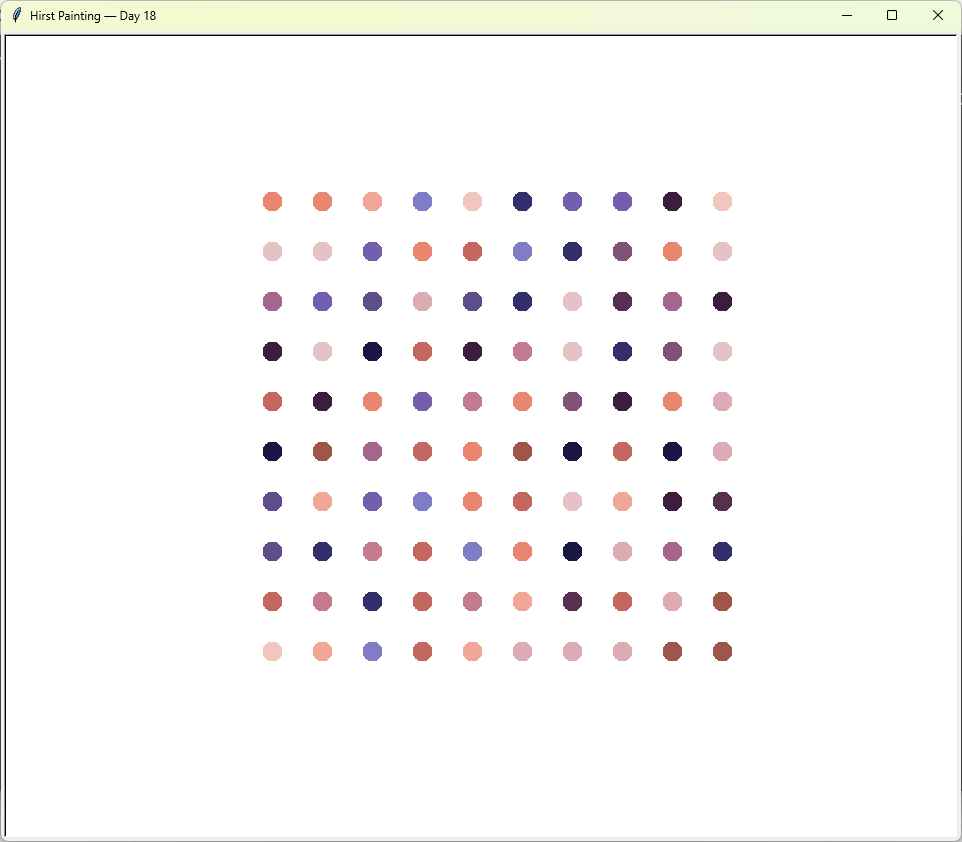

# Hirst Painting
A colourful dot painting inspired by Damien Hirst, drawn with Python's `turtle` module. The colour palette is extracted from a real image using `colorgram.py`.

## What I Practiced
- Extracting a colour palette from an image with `colorgram.py`.
- Using `turtle` graphics: `dot()`, `setheading()`, `forward()`.
- Building a grid with nested loops.
- Keeping the window open with `screen.mainloop()`.

## How to Run
1. Make sure Python 3 is installed.
2. Open terminal in the `day_018_hirst_painting` folder.
3. Run:
    ```bash
    py main.py
    ```
4. Follow the prompts.

## Requirements
```bash
pip install colorgram.py
```

## Screenshot

