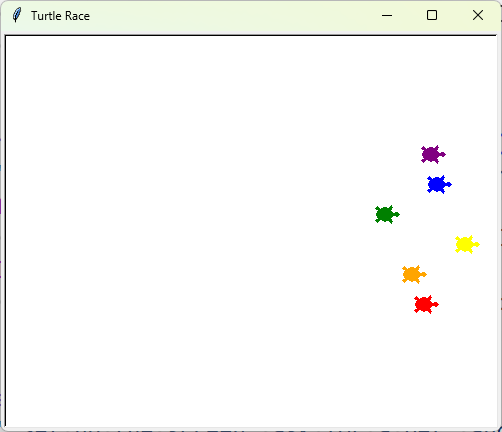

# Turtle Race
Six turtles race across the screen. The user bets on a colour, and the first turtle to reach the right edge wins.

## What I Practiced
- Using `turtle.Screen()` and `turtle.Turtle()` objects.
- Getting user input with `screen.textinput()`.
- Creating multiple objects in a loop and storing them in a list.
- Using `xcor()` to check a turtle's position.
- Structuring code with functions and named constants.

## How to Run
1. Make sure Python 3 is installed.
2. Open terminal in the `day_019_turtle_race` folder.
3. Run:
    ```bash
    py main.py
    ```

## Screenshot

