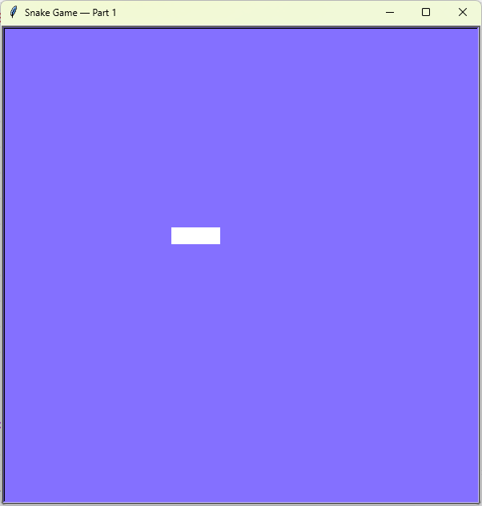

# Snake Game – Part 1
The first part of the classic Snake game: a snake moves across the screen and the player controls its direction with the arrow keys.

## What I Practiced
- Creating a `Snake` class with multiple turtle segments.
- Moving the body by shifting each segment to the position of the one before it.
- Binding keyboard events with `screen.onkey()` and `screen.listen()`.
- Using `screen.tracer(0)` and `screen.update()` for smooth animation.
- Controlling frame rate with `time.sleep()`.

## How to Run
1. Make sure Python 3 is installed.
2. Open terminal in the `day_20_snake_game` folder.
3. Run:
    ```bash
    py main.py
    ```

## Screenshot

