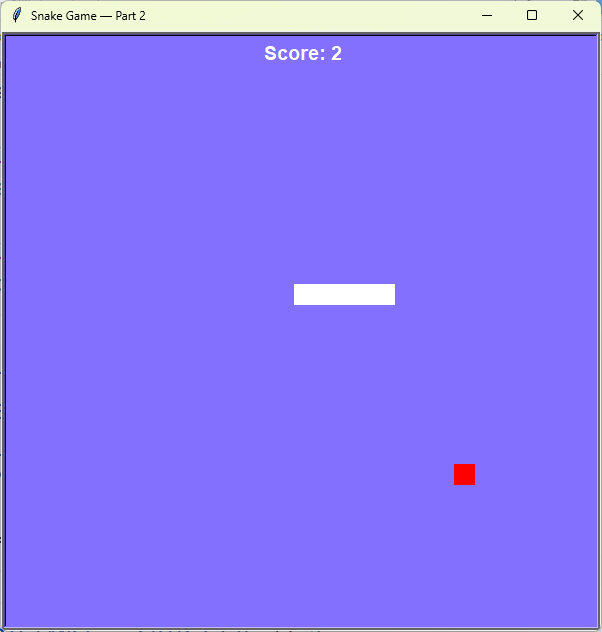

# Snake Game – Part 2
The snake now eats food, grows, and the game ends when it hits the wall or its own tail. The score is displayed on screen.

## What I Practiced
- Class inheritance: `Food` and `Scoreboard` extend `Turtle`.
- Collision detection with `distance()`.
- Growing a list-based snake by adding segments.
- Aligning snake and food to the same coordinate grid.

## How to Run
1. Make sure Python 3 is installed.
2. Open terminal in the `day_21_snake_game` folder.
3. Run:
    ```bash
    py main.py
    ```

## Screenshot

