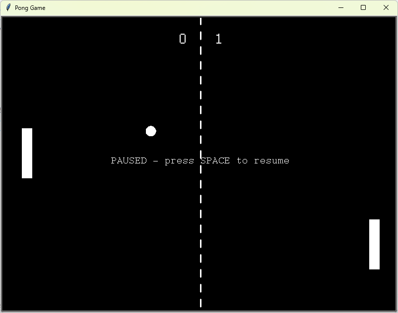

# Pong Game
A two-player Pong game built with `turtle`. Features delta-time physics, angle-based paddle bounces, a central net, pause/restart/quit controls, and a scoreboard.

## What I Practiced
- Structuring a larger project into modules (`settings`, `game`, `ball`, `paddle`, `net`, `scoreboard`, `input_manager`).
- Delta-time animation for frame-rate-independent movement.
- Input manager that distinguishes held keys from one-shot presses.
- Collision detection with tunneling prevention.
- Angle-based bouncing based on where the ball hits the paddle.

## Controls
| Key | Action |
|-----|--------|
| `W` / `S` | Move left paddle up / down |
| `↑` / `↓` | Move right paddle up / down |
| `Space` | Pause / resume |
| `R` | Restart |
| `Q` | Quit |

## How to Run
1. Make sure Python 3 is installed.
2. Open terminal in the `day_22_pong_game` folder.
3. Run:
    ```bash
    py main.py
    ```

## Screenshot

