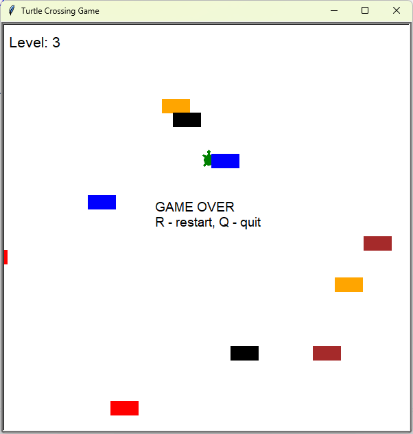

# Turtle Crossing (Frogger)
A Frogger-style game where a turtle tries to cross a road full of cars. Each successful crossing levels up the game, making traffic faster and denser.

## What I Practiced
- Delta-time physics for frame-rate-independent movement.
- Object pooling: off-screen cars are reused instead of recreated.
- Axis-aligned bounding box (AABB) collision detection.
- Level-based difficulty scaling with a geometric decay factor.
- A dedicated HUD class for level and status messages.
- Pause, restart, and quit controls via `onkeypress`.

## Controls
| Key | Action |
|-----|--------|
| `↑` `↓` `←` `→` | Move the turtle |
| `Space` | Pause / resume |
| `R` | Restart |
| `Q` | Quit |

## How to Run
1. Make sure Python 3 is installed.
2. Navigate to the `day_023_turtle_crossing_game` folder.
3. Run the script:
   ```bash
   python main.py
   ```

## Screenshot
