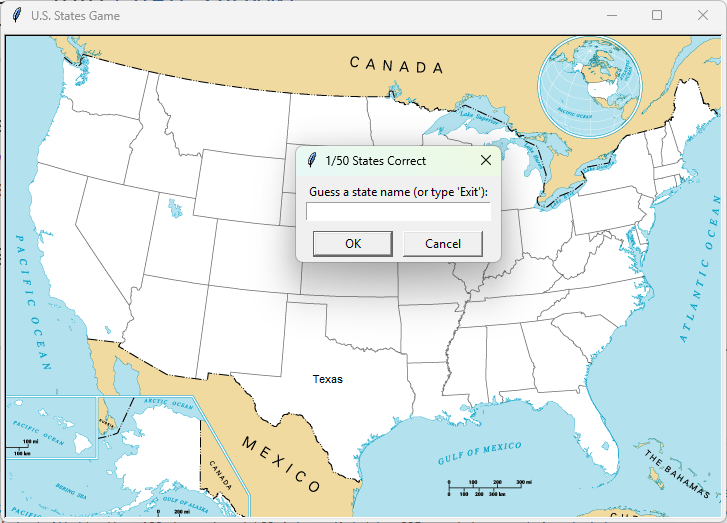

# U.S. States Game
An interactive quiz where the player guesses all 50 U.S. states. Correct guesses appear on a blank map at the state's coordinates. Typing "Exit" saves the missed states to a CSV file.

## What I Practiced
- Reading CSV files with `pandas.read_csv()`.
- Filtering DataFrames with boolean masks and `isin()`.
- Extracting scalar values from a row with `.iloc[0]`.
- Writing CSV files with `DataFrame.to_csv()`.
- Combining Pandas with Turtle for visual output.
- Tracking unique guesses with a `set`.
- Anchoring paths to the script location with `Path(__file__).resolve().parent`.

## How to Run
1. Make sure Python 3 is installed.
2. Install Pandas:
   ```bash
   pip install pandas
   ```
2. Navigate to the `day_025_us_states_game` folder.
3. Run the script:
   ```bash
   python main.py
   ```

## Screenshot

