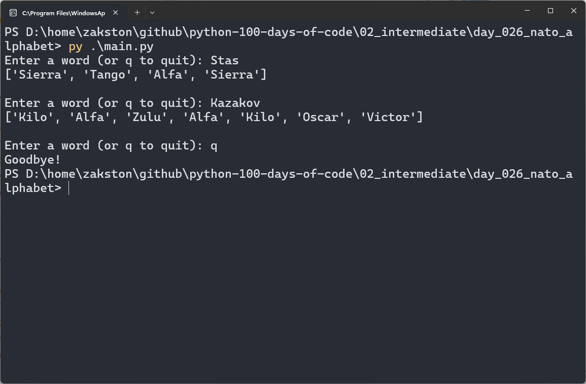

# NATO Phonetic Alphabet
Converts a word into its NATO phonetic alphabet equivalent (e.g. `hello` → `["Hotel", "Echo", "Lima", "Lima", "Oscar"]`).

## What I Practiced
- Reading a CSV file into a Pandas DataFrame with `pd.read_csv()`.
- Building a dictionary from a DataFrame with `.iterrows()`.
- List comprehensions for one-to-one mapping.
- Skipping characters that are not in the alphabet (spaces, punctuation).
- Anchoring paths to the script location with `Path(__file__).resolve().parent`.

## Controls
| Input | Action |
|-------|--------|
| Any word | Translate to NATO code words |
| `q` | Quit |


## How to Run
1. Make sure Python 3 is installed.
2. Install Pandas:
   ```bash
   pip install pandas
   ```
2. Navigate to the `day_026_nato_alphabet` folder.
3. Run the script:
   ```bash
   python main.py
   ```

## Screenshot

