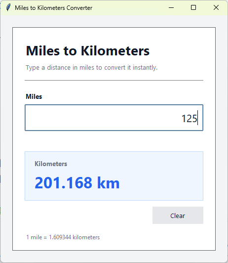

# Miles to Kilometers Converter
A small Tkinter app that converts miles to kilometers as you type. Invalid input and negative values are handled gracefully.

## What I Practiced
- Building a GUI with `tkinter` and `ttk`.
- Using `StringVar` with `trace_add("write", ...)` for reactive updates.
- Validating user input with `try/except`.
- Styling widgets through `ttk.Style` and a custom theme.
- Centering a window on screen with `winfo_screenwidth` / `winfo_screenheight`.
- Binding keyboard shortcuts with `root.bind`.

## Controls
| Input | Action |
|-------|--------|
| Any number | Instantly converts miles to kilometers |
| `Clear` button | Clears the input field |
| `Esc` | Same as the Clear button |

## How to Run
1. Make sure Python 3 is installed (Tkinter ships with it).
2. Navigate to the `day_027_miles_to_km` folder.
3. Run the script:
   ```bash
   python main.py

## Screenshot

