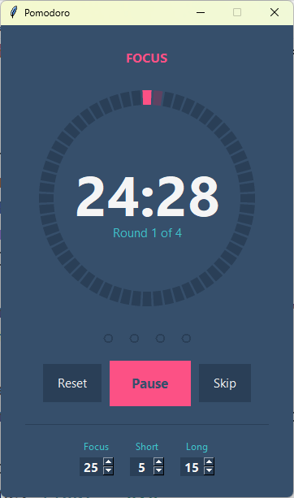

# Pomodoro Timer
A Pomodoro timer with a Color Hunt palette and an anti-aliased segmented ring that fills as time passes. Includes work / short break / long break modes, keyboard shortcuts, and editable durations.

## What I Practiced
- Drawing a custom anti-aliased ring with `PhotoImage` and supersampling.
- Caching rendered frames with a composite key to avoid redundant redraws.
- Using `time.monotonic()` for drift-free timing instead of `time.time()`.
- Reacting to input changes with `StringVar.trace_add`.
- Custom `HoverButton` subclass of `tk.Button` with hover colours.
- Binding keyboard shortcuts with a `Spinbox`-focus guard.
- Structuring a medium-sized Tkinter app with state, rendering, and timer separated.

## Controls
| Input | Action |
|-------|--------|
| `Space` | Start / pause |
| `R` | Reset current session |
| `S` | Skip to the next session |
| `Esc` | Quit |

## How to Run
1. Make sure Python 3 is installed (Tkinter ships with it).
2. Navigate to the `day_028_pomodoro` folder.
3. Run the script:
   ```bash
   python main.py

## Screenshot
